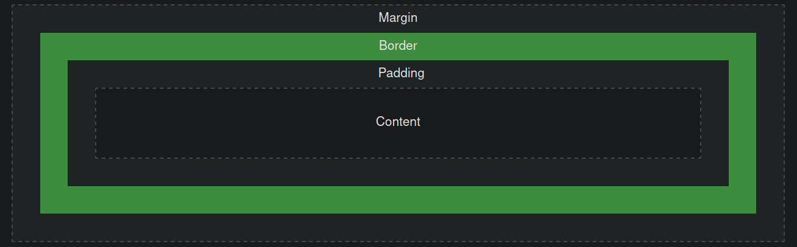

### The CSS Box Model

Explanation of the different parts:

 - **Content** - The content of the box, where text and images appear

 - **Padding** - Clears an area around the content. The padding is transparent

 - **Border** - A border that goes around the padding and content

 - **Margin** - Clears an area outside the border. The margin is transparent

The box model allows us to add a border around elements, and to define space between elements.
