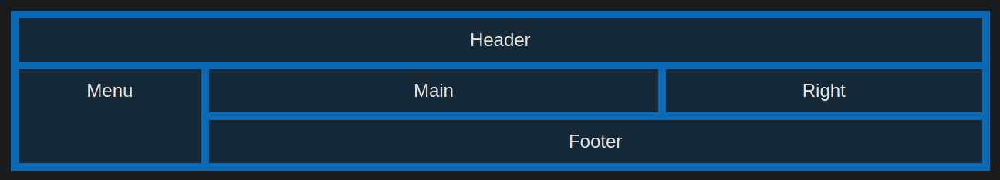

# CSS Grid Layout Module

The CSS Grid Layout Module offers a grid-based layout system, with rows and columns, making it easier to design web pages without having to use floats and positioning.

continue when it's necessary

# Useful Links

[CSS Grid Layout Module - W3School](https://www.w3schools.com/Css/css_grid.asp)
